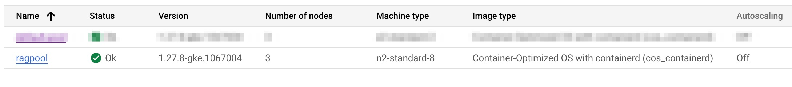

<h1 align="center">RAGFlow based on Neum AI</h1>


**[RAGFlow based on Neumai](https://neum.ai) is a data platform that helps developers leverage their data to contextualize Large Language Models through Retrieval Augmented Generation (RAG)** This includes
extracting data from existing data sources like document storage and NoSQL, processing the contents into vector embeddings and ingesting the vector embeddings into vector databases for similarity search. 

It provides you a comprehensive solution for RAG that can scale with your application and reduce the time spent integrating services like data connectors, embedding models and vector databases.

## Features

- 🏭 **High throughput distributed architecture** . Allows high degrees of parallelization via GKE and celery to optimize embedding generation and ingestion. 
- 🧱 **Built-in GCP data connectors** to gcs data sources, vertexai embedding services and pgVector vector stores.
- ♻ **Customizable data pre-processing** in the form of loading (based on unstructured.io), chunking and selecting.
- 🤝 **Cohesive data management** to support hybrid retrieval with metadata.


## Talk to us

You can reach through email ([asanthan@google.com](mailto:asanthan@google.com)), 

## Getting Started


### Local Development

Clone the repo
```bash
git clone https://source.developers.google.com/p/gcp-cft-base/r/ragflow
cd ragflow
```

Install the [`required`] package:

> ℹ️
> psycopg2-binary requires you to have postgres installed in your machine for e.g. in mac run brew install postgresql@14

```bash
pip install dist/ragflow-0.0.1-py3-none-any.whl
pip install unstructured[all-docs]==0.12.2
pip install unstructured[local-inference]==0.12.2
pip install install pgvector==0.2.5
```


At a high level, a pipeline consists of one or multiple sources to pull data from, one embed connector to vectorize the content,  one sink connector to store said vectors and one eval connector to evaluate the pipeline config with synthetic dat.
With this snippet of code we will craft all of these and run a pipeline:


<details open><summary>

  ### Pre requisites

  - Provisioned GCS Bucket and files placed in the bucket
  - [Provisioned CloudSQL instance with pgVector support](https://cloud.google.com/blog/products/databases/using-pgvector-llms-and-langchain-with-google-cloud-databases)
  - [When running locally configured cloudsql-proxy agent running](https://cloud.google.com/sql/docs/mysql/connect-auth-proxy#mac-m1)
  - [Redis Server](https://redis.io/docs/install/install-redis/install-redis-on-mac-os/)


  ### Concept Overview

  

  ### Creating and running a pipeline
 
  
  ```python
  
  gcs_connector = GCSBlobConnector(
    connection_string="gcs_demo",
    bucket_name=f"{gcs_bucket}",
    batch_size=f"{gcs_pdf_batch_size}",

  )

  source = SourceConnector(
    data_connector=gcs_connector,
    loader=UnstructuredLoader(),
    chunker=RecursiveChunker(chunk_size=500,
                             chunk_overlap=50,
                             batch_size=1000,
                             separators=["\n\n", " ", ""])
    
    
    
  pgVector_sink = AlloyDBVectorStore.AlloyDBSink(
    database_host=f"{database_host}",  
    database_port=f"{database_port}", 
    database_user=f"{database_user}",
    database_pwd=f"{database_pwd}", 
    database_name=f"{database_name}",
    database_table_name=f"{database_table_name}",

  )

  vertexai_embed = VertexAIEmbed.VertexAIEmbed(api_key="<VertexAI AI KEY>")


  )

  pipeline = Pipeline.Pipeline(
    sources=[source],
    embed=vertexai_embed,
    sink=pgVector_sink,

  )

  print(f"Vectors stored: {pipeline.run()}")
  ```

  
### Starting the Pipeline

Make sure you place the PDF , currently tested upto processing of 3000 pages on a single pdf. There is no inherent limit , basically available resources.


```shell

source .env

python app_pdf.py

streamlit run ../chatbot.py

```

</summary>

</details>


<details>
   <summary>
  
  ### Deploying the Services to GCP Cloud
  
  </summary>


  
  ### Pre-requisite Services

  - [Provisioned CloudSQL instance with pgVector support](https://cloud.google.com/blog/products/databases/using-pgvector-llms-and-langchain-with-google-cloud-databases)
  - [Create Auto-pilot or standard GKE Cluster](https://cloud.google.com/kubernetes-engine/docs/how-to/creating-a-zonal-cluster)
    - 
    - Enable Workload identity
    - Enable Filestore CSI driver
    - For Enterprise deployment make sure you create Private Cluster
  - [Create Filestore NFS](https://medium.com/@prayag-sangode/create-nfs-share-using-google-filestore-fc00b58f5731)
  - [Configure Artifact Registry Repository](https://cloud.google.com/artifact-registry/docs/docker)

  ### Building Docker image using Cloud Build
   
    
  ```shell
  cd ragflow
  gcloud builds submit --tag us-central1-docker.pkg.dev/<projectid>/<container_repo>/ragpipeline:v1 .
   ```

  ### Configure Persistence Volume in your GKE Cluster

  In this section we will configure the NFS Volume claim for access to POD Workers to process the PDF files.  Use the link below to connect to GKE cluster    
  > [!TIP]
  > [Accessing GKE Cluster](https://cloud.google.com/kubernetes-engine/docs/how-to/cluster-access-for-kubectl)

      
  #### Create Storage Class
  ```shell
    cd ragflow/k8s/rag_storage
    kubectl apply -f filestore-sc.yaml
   ```

  #### Create Persistent Volume
  Please the nfs section of the yaml file to reflect the filestore nfs share from the pre-requisite step above
  ```shell
    cd ragflow/k8s/rag_storage
    kubectl apply -f rag-fs-pv.yaml
   ```

  #### Create Persistent Volume Claim
  Please the nfs section of the yaml file to reflect the filestore nfs share from the pre-requisite step above
  ```shell
    cd ragflow/k8s/rag_storage
    kubectl apply -f rag-fs-pvc.yaml
   ```

### Configure Workload Identity in your GKE Cluster

> ℹ️
> In this section we will create service account and configure the services and associate it with workload identity


  #### Create Service Account
  ```shell
    gcloud iam service-accounts create ragflow-svcacc \
  --description="DESCRIPTION" \
  --display-name="DISPLAY_NAME"
  
  gcloud projects add-iam-policy-binding PROJECT_ID \
  --member="serviceAccount:ragflow-svcacc@PROJECT_ID.iam.gserviceaccount.com" \
  --role="roles/cloudsql.client"
  
   gcloud projects add-iam-policy-binding PROJECT_ID \
  --member="serviceAccount:ragflow-svcacc@PROJECT_ID.iam.gserviceaccount.com" \
  --role="roles/cloudsql.instanceUser"
  
  gcloud projects add-iam-policy-binding PROJECT_ID \
  --member="serviceAccount:ragflow-svcacc@PROJECT_ID.iam.gserviceaccount.com" \
  --role="roles/iam.serviceAccountTokenCreator"
  
  gcloud projects add-iam-policy-binding PROJECT_ID \
  --member="serviceAccount:ragflow-svcacc@PROJECT_ID.iam.gserviceaccount.com" \
  --role="roles/aiplatform.serviceAgent"
  
  gcloud projects add-iam-policy-binding PROJECT_ID \
  --member="serviceAccount:ragflow-svcacc@PROJECT_ID.iam.gserviceaccount.com" \
  --role="roles/aiplatform.user"
  
   ```


  #### Associate the Service Account to Workload Identity
> ℹ️
> Please update the service account name in the serviceAccount.yaml
  ```shell
    cd ragflow/k8s/svcAccount
    kubectl apply -f sericeAccount.yaml
    
    gcloud iam service-accounts add-iam-policy-binding \
    "ragflow-svcacc@<PROJECT_ID>.iam.gserviceaccount.com" \
    --member "serviceAccount:<PROJECT_ID>.svc.id.goog[default/k8s-service-account]" \
    --role "roles/iam.workloadIdentityUser" \
    --project <PROJECT_ID>
    
    
   ```

  ### Deploying the Apps

#### Configure Database

- [Connect to CloudSQL using CloudSql Proxy](https://cloud.google.com/sql/docs/postgres/connect-instance-auth-proxy)

> ℹ️
> Please connect to the CloudSQL instance and execute the following
  
  ```sql
    -- Create DB:
    
    CREATE DATABASE <DB_NAME>;
    
    \c <DB_NAME>
    
    -- Create pgvector Extension
    
    CREATE EXTENSION vector;
    
    -- Create Table:
    CREATE TABLE IF NOT EXISTS public.<TABLE_NAME>
    (
        id character varying(100) COLLATE pg_catalog."default",
        file_id text COLLATE pg_catalog."default",
        chunk_content text COLLATE pg_catalog."default",
        chunk_metadata text COLLATE pg_catalog."default",
        embedding vector(768)
    )
    TABLESPACE pg_default;

    -- Change Owner to User:

    ALTER TABLE IF EXISTS public.<TABLE_NAME>
        OWNER to <USER>;

    -- Index:

    CREATE INDEX IF NOT EXISTS sabre_vector_synxis_embedding_idx
        ON public.sabre_vector_synxis USING ivfflat
        (embedding vector_cosine_ops)
        WITH (lists=100)
        TABLESPACE pg_default;
    
   ```

  #### Local Redis Broker


  ```shell
    cd ragflow/k8s/redis
    kubectl apply -f redis.yaml
   ```

 #### RAG Pipeline API
> ℹ️
> Please update the container image url to reflect the artifact registry repo

  ```shell
    cd ragflow/k8s/rag_main
    kubectl create secret generic pgvector-store-secrets \
    --from-literal=VECTOR_DB=<DB> \
    --from-file=VECTOR_USER=<USER> \
    --from-literal=VECTOR_PWD='<Your Password>'
    
    kubectl apply -f rag_celery_app.yaml
    kubectl apply -f rag_api_celery_app_svc_internal.yaml
    
   ```

 #### RAG Workers
> ℹ️
> Please update the container image url to reflect the artifact registry repo

  ```shell
    cd ragflow/k8s/rag_workers

    
    kubectl apply -f rag_celery_worker_data_extraction.yaml
    kubectl apply -f rag_celery_worker_data_processing.yaml
    kubectl apply -f rag_celery_worker_data_embeddings.yaml
    
   ```


</details>

