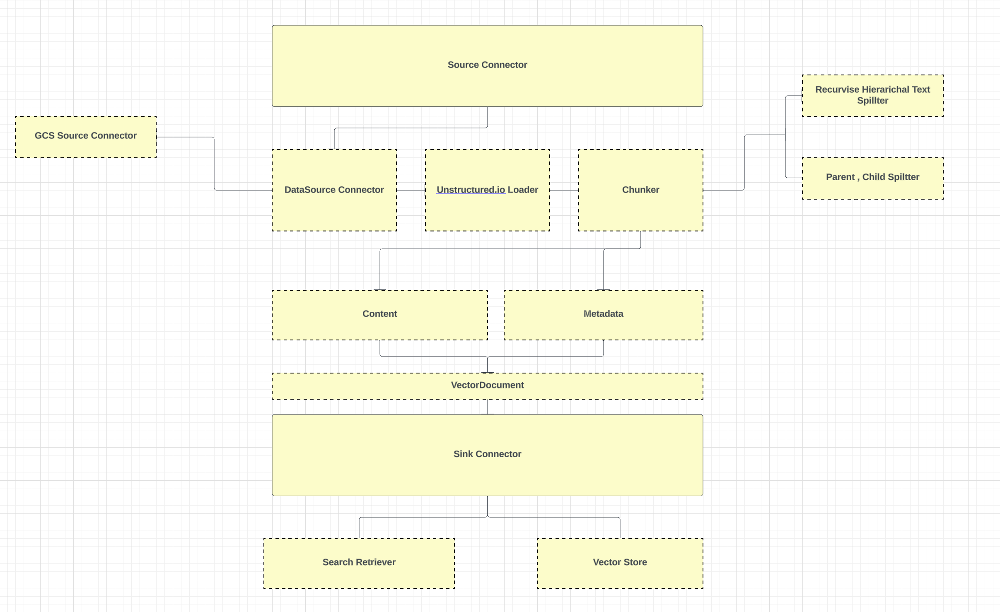
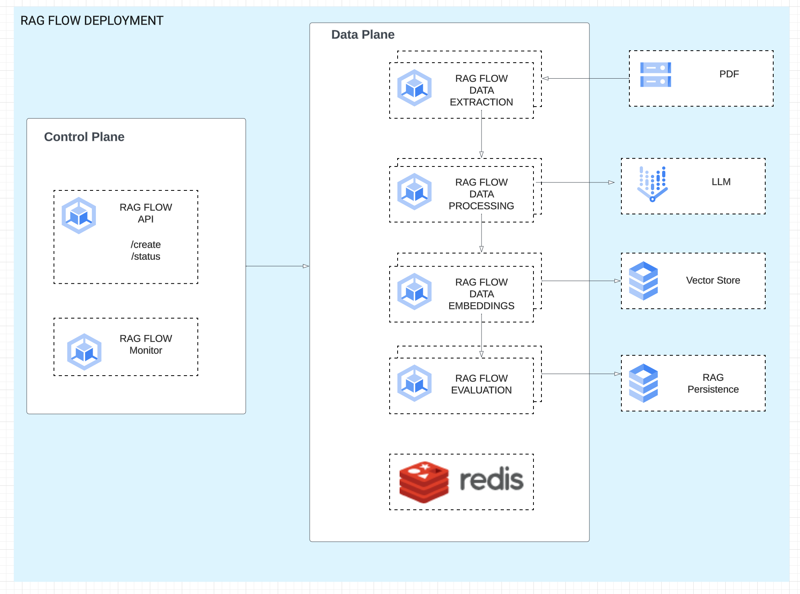

<h1 align="center">RAGFlow based on Neum AI</h1>


**[RAGFlow based on Neumai](https://neum.ai) is a data platform that helps developers leverage their data to contextualize Large Language Models through Retrieval Augmented Generation (RAG)** This includes
extracting data from existing data sources like document storage and NoSQL, processing the contents into vector embeddings and ingesting the vector embeddings into vector databases for similarity search. 

It provides you a comprehensive solution for RAG that can scale with your application and reduce the time spent integrating services like data connectors, embedding models and vector databases.

## Features

- 🏭 **High throughput distributed architecture** . Allows high degrees of parallelization via GKE and celery to optimize embedding generation and ingestion. 
- 🧱 **Built-in GCP data connectors** to gcs data sources, vertexai embedding services and pgVector vector stores.
- ♻ **Customizable data pre-processing** in the form of loading (based on unstructured.io), chunking and selecting.
- 🤝 **Cohesive data management** to support hybrid retrieval with metadata.


## Talk to us

You can reach through email ([asanthan@google.com](mailto:asanthan@google.com)), 

## Getting Started


### Local Development

Clone the repo
```bash
git clone 
```

Install the [`required`] package:

```bash
pip install -r requirements.txt
```


At a high level, a pipeline consists of one or multiple sources to pull data from, one embed connector to vectorize the content,  one sink connector to store said vectors and one eval connector to evaluate the pipeline config with synthetic dat.
With this snippet of code we will craft all of these and run a pipeline:


<details open><summary>

  ### Pre requisites

  - Provisioned GCS Bucket and files placed in the bucket
  - [Provisioned CloudSQL instance with pgVector support](https://cloud.google.com/blog/products/databases/using-pgvector-llms-and-langchain-with-google-cloud-databases)
  - [When running locally configured cloudsql-proxy agent running](https://cloud.google.com/sql/docs/mysql/connect-auth-proxy#mac-m1)
  - [Redis Server](https://redis.io/docs/install/install-redis/install-redis-on-mac-os/)

  ### Concept Overview

  

  ### Creating and running a pipeline
  </summary>
  
  ```python
  
  gcs_connector = GCSBlobConnector(
    connection_string="gcs_demo",
    bucket_name=f"{gcs_bucket}",
    batch_size=f"{gcs_pdf_batch_size}",

  )

  source = SourceConnector(
    data_connector=gcs_connector,
    loader=UnstructuredLoader(),
    chunker=RecursiveChunker(chunk_size=500,
                             chunk_overlap=50,
                             batch_size=1000,
                             separators=["\n\n", " ", ""])
    
    
    
  pgVector_sink = AlloyDBVectorStore.AlloyDBSink(
    database_host=database_host,  
    database_port=database_port, 
    database_user=database_user,
    database_pwd=database_pwd, 
    database_name=database_name,
    database_table_name=database_table_name,

  )

  vertexai_embed = VertexAIEmbed.VertexAIEmbed(api_key="<VertexAI AI KEY>")


  )

  pipeline = Pipeline.Pipeline(
    sources=[source],
    embed=vertexai_embed,
    sink=pgVector_sink,

  )

  print(f"Vectors stored: {pipeline.run()}")
  ```
<summary>
  
### Starting the Pipeline

Make sure you place the PDF , currently only supports 10 PDF pages due the bug on multimodal processing , will be fixed in next minor release


```shell

source .env

python app.py

streamlit run chatbot.py

```

</summary>

</details>


<details><summary>
  
  ### Deploying the Services to GCP Cloud
  </summary>


  
 Instructions TBD


</details>

